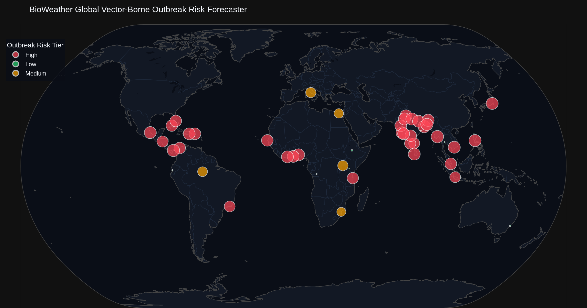

# 🦟 BioWeather: Global Disease Outbreak Risk Forecaster


**BioWeather** is a fully autonomous, self-updating global disease-outbreak-risk forecaster created by **Rohith Ashwa Vardhan**. It monitors climate-driven vector-borne diseases (such as Dengue, Malaria, Chikungunya, and Zika). 

Every hour, a scheduled **GitHub Action** automatically pulls fresh global climate telemetry from open APIs, engineers epidemiological suitability features, runs a trained **PyTorch deep learning model**, generates interactive & static risk maps, and commits the updated intelligence directly back to this repository—**requiring zero manual intervention**.

---

## 🛰️ Real-Time Outbreak Risk Forecast

<!-- RISK_MAP_START -->

### 🌍 Real-Time Vector Transmission Risk Summary
**Last Updated:** `2026-08-16 21:47:40 UTC`  
**Monitored Regions:** `47` global urban & endemic centers  
**Project Lead & Creator:** **Rohith Ashwa Vardhan**

| Outbreak Risk Tier | Region Count | Percentage |
| :--- | :---: | :---: |
| 🔴 **High Risk** | `34` | `72.3%` |
| 🟠 **Medium Risk** | `5` | `10.6%` |
| 🟢 **Low Risk** | `8` | `17.0%` |

#### 🚨 Current High-Risk Vector Transmission Zones

| Region | Country | Endemic Focus | 14-Day Temp | Humidity | Risk Score |
| :--- | :--- | :--- | :---: | :---: | :---: |
| **Yangon** | Myanmar | Malaria/Dengue | 26.4°C | 91.67% | `0.88` |
| **Kolkata** | India | Dengue/Malaria | 28.36°C | 87.9% | `0.86` |
| **Panama City** | Panama | Dengue | 27.22°C | 87.0% | `0.85` |
| **Guwahati** | India | Malaria/JE | 28.41°C | 87.1% | `0.85` |
| **Lucknow** | India | Dengue/JE | 28.74°C | 86.57% | `0.85` |
| **Manila** | Philippines | Dengue | 26.96°C | 86.0% | `0.85` |
| **New Delhi** | India | Dengue/Chikungunya | 28.65°C | 86.05% | `0.85` |
| **Dhaka** | Bangladesh | Dengue | 28.42°C | 85.52% | `0.84` |
| **Lagos** | Nigeria | Malaria | 25.86°C | 84.67% | `0.83` |
| **Mumbai** | India | Dengue/Malaria | 27.23°C | 82.95% | `0.83` |
| **Ho Chi Minh City** | Vietnam | Dengue | 27.84°C | 82.24% | `0.83` |
| **Jaipur** | India | Dengue/Malaria | 27.82°C | 82.1% | `0.82` |
| **Colombo** | Sri Lanka | Dengue | 27.23°C | 81.67% | `0.82` |
| **Abidjan** | Cote d'Ivoire | Malaria | 25.1°C | 83.95% | `0.82` |
| **Veracruz** | Mexico | Dengue | 27.84°C | 80.76% | `0.82` |
| **Patna** | India | Dengue/Kala-azar | 29.5°C | 82.86% | `0.82` |
| **Tokyo** | Japan | Low Baseline | 25.72°C | 81.52% | `0.81` |
| **Pune** | India | Dengue/Zika | 24.15°C | 84.71% | `0.81` |
| **Accra** | Ghana | Malaria | 25.54°C | 80.19% | `0.80` |
| **Santo Domingo** | Dominican Republic | Dengue | 27.63°C | 78.57% | `0.80` |
| **San Juan** | Puerto Rico | Dengue | 28.37°C | 77.95% | `0.79` |
| **Singapore** | Singapore | Dengue | 28.16°C | 77.19% | `0.78` |
| **Ahmedabad** | India | Dengue/Malaria | 28.55°C | 77.19% | `0.78` |
| **Dakar** | Senegal | Malaria | 28.77°C | 77.1% | `0.78` |
| **Miami** | United States | Low Baseline | 28.98°C | 77.29% | `0.77` |
| **Cartagena** | Colombia | Dengue | 29.33°C | 77.29% | `0.77` |
| **Hyderabad** | India | Dengue/Malaria | 26.33°C | 73.95% | `0.75` |
| **Havana** | Cuba | Dengue | 28.79°C | 73.52% | `0.74` |
| **Dar es Salaam** | Tanzania | Malaria | 24.69°C | 75.05% | `0.74` |
| **Bengaluru** | India | Dengue | 23.48°C | 77.81% | `0.72` |
| **Tegucigalpa** | Honduras | Dengue | 23.53°C | 76.1% | `0.71` |
| **Chennai** | India | Dengue/Chikungunya | 30.0°C | 71.19% | `0.68` |
| **Rio de Janeiro** | Brazil | Dengue | 22.8°C | 76.95% | `0.68` |
| **Jakarta** | Indonesia | Dengue | 28.82°C | 67.71% | `0.67` |



*Interactive map view available at [BioWeather GitHub Pages / latest_map.html](docs/latest_map.html).*

<!-- RISK_MAP_END -->

---

## 🧬 Methodology & Architecture

The BioWeather forecast pipeline follows a 5-tier architecture:

```
[Open-Meteo / NASA POWER APIs] 
            │
            ▼
[Data Ingestion (src/ingest.py)] ──> Raw JSON Cache (data/raw/)
            │
            ▼
[Feature Engineering (src/features.py)] ──> Rolling Epidemiological Metrics & R0 Proxies (data/processed/)
            │
            ▼
[PyTorch Inference (models/infer.py)] ──> Outbreak Risk Index (0.0 - 1.0) & Risk Tiers
            │
            ▼
[Visualization & Automation (src/map_generator.py + GitHub Actions)] ──> Interactive HTML & Static README Maps
```

### 1. Data Ingestion (`src/ingest.py`)
- Ingests 14-day historical and 7-day forecast climate series across **47 representative global urban centers** (including 14 major Indian cities), with heavy weighting toward Dengue/Malaria endemic regions (South & SE Asia, Sub-Saharan Africa, Latin America & Caribbean).
- Primary Source: **Open-Meteo API** (Keyless, high-resolution global telemetry).
- Fallback Source: **NASA POWER API** (Keyless solar & meteorological archive).
- Features automatic retries with exponential backoff and persistent raw payload logging in `data/raw/`.

### 2. Epidemiological Feature Engineering (`src/features.py`)
- Calculates 14-day rolling mean temperature (°C), relative humidity (%), and cumulative precipitation (mm).
- Computes **Vectorial Capacity & $R_0$ Transmission Suitability Proxies** derived from thermal response literature (*Mordecai et al. 2016, 2019*).
- Mosquito vector reproduction (*Aedes aegypti*, *Anopheles*) peaks in temperature windows between 25°C – 29°C with relative humidity > 60%, dropping sharply below 15°C and above 38°C.

### 3. Deep Learning Risk Model (`models/`)
- Implemented in **PyTorch** (`BioWeatherRiskModel`).
- Evaluates multi-dimensional climate feature vectors to output a normalized **Outbreak Transmission Risk Index (0.0 to 1.0)**:
  - 🔴 **High Risk ($\ge 0.65$)**: Optimal climate suitability for rapid vector proliferation & viral replication.
  - 🟠 **Medium Risk ($0.35 - 0.64$)**: Moderate transmission suitability; potential seasonal surge.
  - 🟢 **Low Risk ($< 0.35$)**: Sub-optimal thermal or moisture conditions for vector transmission.

---

## ⚠️ Important Scientific & Regulatory Disclaimer

> [!IMPORTANT]
> **Proxy Target & Model Limitations:**  
> Live open-access APIs for real-time epidemiological case counts (e.g. daily clinical hospital admissions) do not exist globally. Therefore, BioWeather is trained on **environmental and thermal vector suitability proxies** derived from peer-reviewed entomological research (*Mordecai et al.*), rather than clinical diagnostic records.  
>  
> **This tool is for research, educational, and environmental monitoring purposes only.** It does NOT constitute clinical advice, medical diagnosis, or official public health guidance.

---

## 💻 Local Running & Development

### Prerequisites
- Python 3.11+
- `pip`

### Setup & Execution
```bash
# Clone the repository
git clone https://github.com/your-username/BioWeather.git
cd BioWeather

# Install dependencies
pip install -r requirements.txt

# Step 1: Run climate ingestion
python src/ingest.py

# Step 2: Run feature engineering
python src/features.py

# Step 3: Train model (optional - pre-trained weights included)
python models/train.py

# Step 4: Run inference
python models/infer.py

# Step 5: Generate interactive map & README section
python src/map_generator.py
python src/update_readme.py
```

---

## 👨‍💻 Project Lead & Attribution

**Created & Developed by:** **Rohith Ashwa Vardhan**

---

## 📡 Data Sources & Attribution

- **Open-Meteo**: Weather forecast API provided under CC BY 4.0. [open-meteo.com](https://open-meteo.com/)
- **NASA POWER**: Prediction Of Worldwide Energy Resources project. [power.larc.nasa.gov](https://power.larc.nasa.gov/)

---

## 📜 License

Distributed under the MIT License. See [`LICENSE`](LICENSE) for details.
